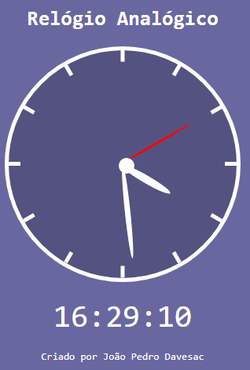

<h1>Projeto Relógio Analógico + Digital</h1>

Pequeno projeto de um relógio analógico
                 e digital. Somente visual, sem interações de clique.

       

<ul> 
    <h2>Tecnologias Usadas</h2>
    <li>HTML</li>
    <li>CSS</li>
    <li>JS</li>
</ul>

<h3>Feito por João Pedro Davesac</h3>

E-mail: jpdavesac123@gmail.com

Linkedin: https://www.linkedin.com/in/jo%C3%A3o-pedro-davesac-a4862b212/
 